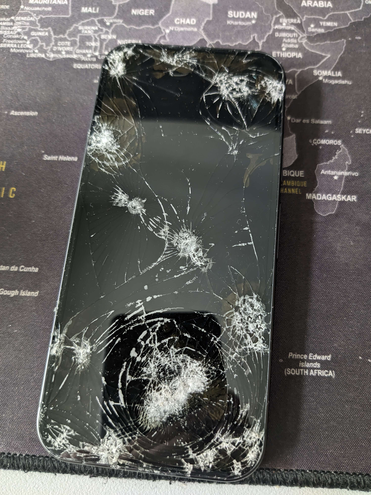
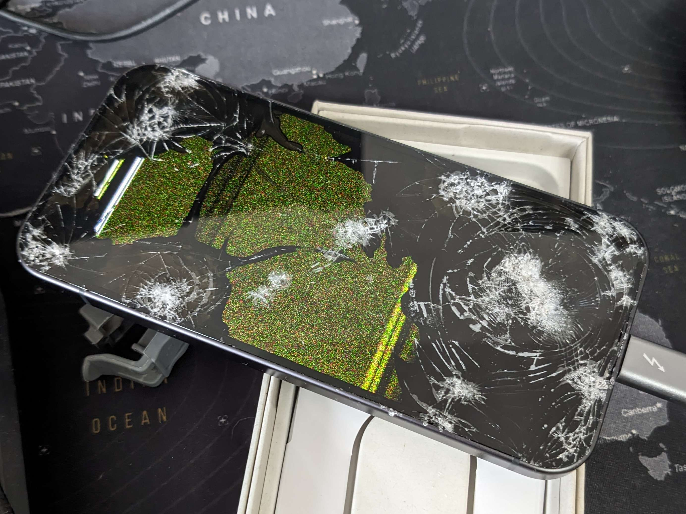
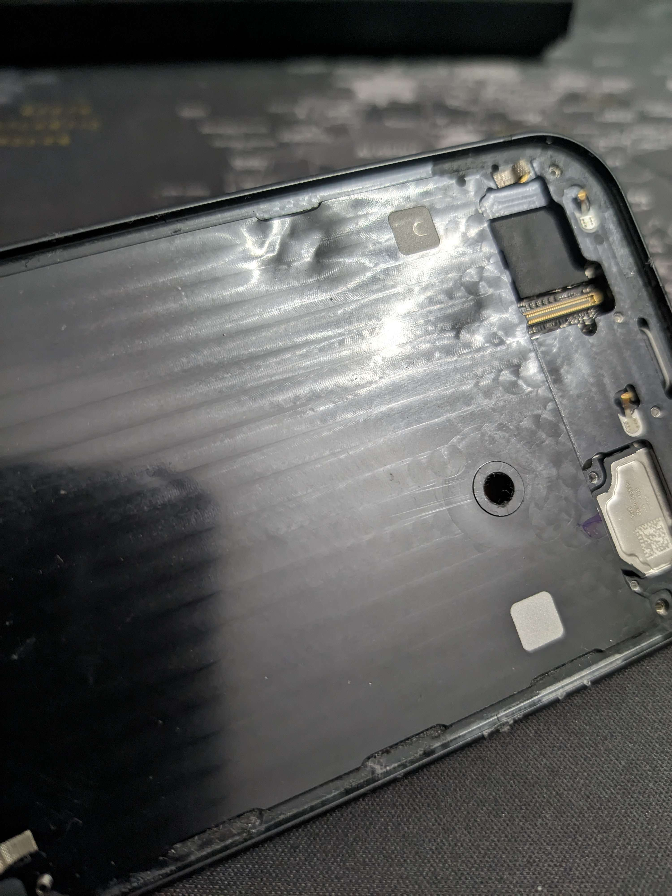
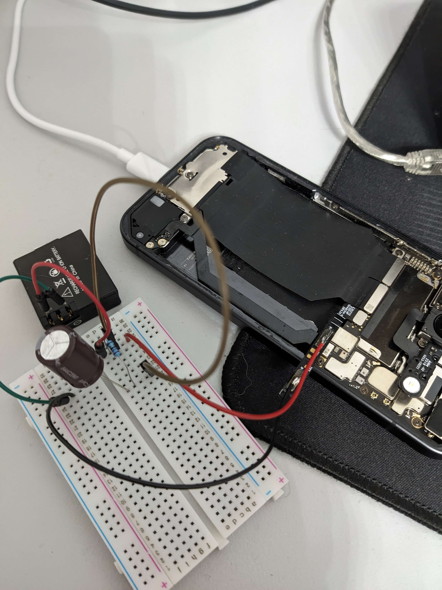

# 📱 Pixel 9 → Headless Linux Server

This is not a guide. It is the documentation of my journey converting a broken Pixel 9 into a headless Linux server.  
A proper guide will likely follow once everything is fully stable and reproducible.


## Table of Contents
- [0. Hardware State](#0-hardware-state)
- [1. Initial Access (UI Control)](#1-initial-access-ui-control)
- [2. Enable Debugging](#2-enable-debugging)
- [3. scrcpy Access](#3-scrcpy-access)
- [4. Check Functionality](#4-check-functionality)
- [5. Removing the broken Screen](#5-removing-the-broken-screen)
- [6. Debug Battery "Replacement"](#6-debug-battery-replacement)
- [7. Goodbye Android](#7-goodbye-android)
- [8. Enable OEM-Unlock](#8-enable-oem-unlock)
- [9. Bootloader Unlock](#9-bootloader-unlock)
- [10. Disable Security Related Features](#10-disable-security-related-features)
- [11. Change init_boot.img Signature](#11-change-init_bootimg-signature)
- [12. Init Debugging](#12-init-debugging)
- [13. Sleep-Debugging](#13-sleep-debugging)
- [14. USB Gadget (Serial Console)](#14-usb-gadget-serial-console)
- [15. InitRAMFS Shell](#15-initramfs-shell)
- [16. Storage Layout Discovery](#16-storage-layout-discovery)
- [17. Recovery Mode | Mass Storage](#17-recovery-mode--mass-storage)
- [18. Debian RootFS](#18-debian-rootfs)
- [19. Mount + Chroot RootFS](#19-mount--chroot-rootfs)
- [Future Work](#future-work)

## Situation

The phone fell out of a pocket and landed face down on a parking lot during a rainy day. It had been lying there for a couple of hours before it was found again. By that point, the damage was already clearly visible.  
On top of the physical damage, the device is also enrolled in Family Link, which introduces an additional layer of restrictions that limits access to system settings and developer features.


## 0. Hardware State

**Device:** Google Pixel 9

The screen is completely unusable. There is no touch input and no visible image output. The front glass is severely damaged, as shown below:




The rear glass, however, is still intact, which is honestly surprising given the condition of the front. The device itself still appears to operate normally. A short press of the power button turns the display on and off, which strongly suggests that the phone is sitting in the normal lock screen state rather than being fully unresponsive.  
A long press on the power button triggers a brief vibration, which likely indicates that the system is still responsive enough to bring up either the power menu or a voice assistant like Gemini. Even without a usable display, this small interaction is enough to confirm that the underlying system seems so be still running and reacting normally to input.

---

Although my current phone is still functional, it is already getting old. My initial thought was therefore fairly simple: replace the broken screen and continue using the Pixel 9. iFixit even provides official replacement parts, which made this option seem realistic at first.  
However, the more I thought about it, the less straightforward it became. The repair is still relatively expensive for a device I do not strictly need, and the frame at the front appears to be unfavorable dented in places. This raised the concern that even after replacing the display, additional mechanical work such as sanding the frame might be required to make everything fit properly again.

At that point, I was genuinely undecided about what to do with the device—assuming the internal hardware was even still fully intact.


## 1. Initial Access (UI Control)

<!-- ### Goal -->

The first step is to determine whether the device was still functionally usable at all. In particular, I needed to know if the system was still responsive—whether apps could launch and basic navigation still worked.

<!-- ### Idea -->

Since the Pixel 9 supports display output via USB-C, the idea was to bypass the broken screen entirely. If the internal hardware and Android system were still intact, I should be able to use an external monitor together with input devices to interact with the phone
— Kind of like treating the Phone like a tiny desktop computer even though it is not a Samsung device that has an offical mode for it.

<!-- ### Method -->

I borrowed a USB-C hub and checked with a friend who owns the same phone to understand the exact steps required to get external display output working.  
The setup itself is straightforward: HDMI was connected to a monitor, and USB devices such as a mouse and keyboard were plugged into the hub. Once connected, input via mouse and keyboard worked immediately - wakig up the the "screen" worked on a button press.  
However, display output is not automatically enabled and needs to be confirmed on the device itself — specifically after unlocking it.

<!-- ### Unlocking the Device and Enabling Output -->

Since the screen was unusable, everything had to be done blindly using the external input devices.  
I started by simulating the usual unlock gesture with the mouse (a swipe up) to bring up the PIN entry field. After entering the PIN and confirming with `Enter`, the device unlocked successfully - at least it should be.  
To enable display output, I navigated the UI using the keyboard. By repeatedly pressing the right arrow key (`→`) and confirming with `Enter`. After a few attempts I found a method that was quite reliablely accepting the prompt that enables external display output:  
- Spamming the arrow key a few times to ensure that the correct button was focused.

<!-- ### Nice to Have -->

At this point, of the first quality-of-life improvements was to remove the lock screen PIN entirely. Since all interaction depends on somewhat fragile input assumptions, reducing the number of required steps and therefore possible failure points greatly simplifies further work.


## 2. Enable Debugging

<!-- ### Goal -->

After getting basic UI access through the USB-C hub, the next step was to simplify the setup.  
While the hub approach worked, it was clearly not something I wanted to rely on long term. So my plan was to reduce everything down to a single, stable connection to a host PC.  
There is a tool called [scrcpy](https://github.com/genymobile/scrcpy) that allows controlling and mirroring an Android device via USB debugging.  
If this works, it would replace the entire hub setup with just one cable: plug the phone into a computer and immediately get full control over the device.

— So my theory.

### Family Link Restrictions

Enabling USB debugging requires access to the developer options.  
However, because the device is managed via Family Link, these settings are blocked by default.  
So even though the phone itself is working, some of the most useful low-level features are locked behind parental controls.  
It is possible to enable developer options from the parent device.  
This lifts the restriction in principle, but it does not fully solve the problem—you still need to go into the settings on the phone itself and enable the required options manually.

Which, again, has to be done blindly or through the somewhat annoying external display setup.


### Enabling USB Debugging

Once inside the developer options, the relevant settings are:

- **USB debugging**, which allows ADB access from a host PC  
- **“Never revoke authorizations”** or **“Disable adb authorization timeout”** - whatever is was called again- , which prevents trusted devices from being removed after a few days of inactivity  

The second option turned out to be especially important.  
Since access to the device depends on a working connection and some luck with input. Having to re-authorize a PC every few days would introduce another unnecessary point of failure.


## 3. scrcpy Access

The first problem when trying to use `scrcpy` is the ADB authorization dialog. 
This prompt has to be confirmed manually on the phone itself, which immediately becomes kind of impossible when the screen is unusable with only pixel noise in a some areas that get smaller with each day.  
Then the second complication is a direct consequence of the first one: while the USB hub is connected it allows input. But this creates the unfortunate situation, that I need the connection to the hub while i want the wired debugging connection to the host PC.

The workaround was to temporarily reconnect the USB-C hub setup and pair a wireless input device, such as a Bluetooth keyboard or game controller. This allowed me to keep input capability even when the hub was not actively connected.
With this setup, I reconnected the phone to the host PC and attempted to approve the ADB authorization prompt. The goal was to enable the “Always allow from this computer” option so that the device would permanently trust the machine and not require repeated confirmation.
Here, I do not fully remember the exact key sequence anymore. The most likely approach was navigating with the arrow keys, check the "Alway allow" box with `Enter`, followed by the proven method of spamming right and confirming with `Enter`. 
After completing this step, the connection could be verified on the PC side using:

```bash
adb devices
```

Once the device appeared correctly in the list, you can reconnect the phone and hope for the best that you hit the “Always allow” button.

### Note

I also tried using wireless debugging, but it was not stable in practice. Each time it had to be re-enabled, and both the port and pairing PIN would change on every session, which made it unreliable for a persistent setup.


## 4. Check Functionality

### Pixel Diagnostics

To verify that the hardware was still in a usable state, Google provides a built-in diagnostic tool by calling:  
`*#*#7287#*#*`  
From there, I ran a full set of hardware tests.  
In my case, everything appeared to be functioning normally except for the rear microphone, which seemed to be the only component showing abnormal behavior, effectively recording silence.

### General Check

Beyond the formal diagnostics, I also spent some time testing the phone in a more practical way —checking responsiveness, connectivity, and whether anything else behaved unexpectedly.  
At this stage, the device still behaved essentially like a normal phone —except for the part with the screen—, so overall, it did not seem to have any further serious hardware damage.


## 5. Removing the Broken Screen

At this point, the next logical step was fairly straightforward. The initial software-side inspection suggested that most of the hardware was still functional, so the next step was to physically assess the device more directly.  
In practice, this meant the screen had to come off regardless of the final outcome. The display was already broken, while the backside was still intact, so approaching the device from the front was the safer option.
If the internal inspection would not reveal any additional damage, this would allow for a relatively simple repair—replacing only the screen without having to remove the rear glass. Avoiding work on the backside was preferable, as it would introduce the risk of damaging components that were still in good condition —like the actuall back glass itself.
At the same time, removing the screen provided the a good starting point to check for any hidden structural or internal damage that was not visible from the outside.

Unfortunately, this quickly revealed that the internal metal frame was not in perfect condition either. It showed visible deformation in a few spots, concentrated on the lower right side:

The more concerning part was that directly behind that area sits the battery. Seeing the frame bent in that region immediately raised concerns about how much force had been transferred into the battery during the impact.


### Inspecting the Battery

Removing the rear glass itself was relatively easys but still took a long time, as i do not take apart phones on a daily basis. Once inside, after removign a large metal conver and the NFC coil, at first glance everything seemed to be in a good contition. So, moving on to the battery...  
Removing the battery itself took WAAAAAAY longer than expected. This single large pull tab is just a joke—even with generous use of isopropanol. Instead of cleanly releasing, it became a slow and somewhat frustrating process of using the tab almost like a saw to "cut" the glue —or better, to soften it into a sticky, pasty mess— step by step, with isopropanol, over the course of a couple of hours.

Eventually, the battery did come out, but the result was not very encouraging.
It showed visible dents, which makes it difficult to trust for any kind of long-term use. Even if it still technically functions, it is no longer something I would feel comfortable relying on in a rebuilt device.


### Conclusion

At this stage, it was clear that the device needed more than a simple repair. What initially looked like a straightforward screen replacement had evolved into something closer to a restoration project.  
A proper rebuild would now require:  
- a new display  
- a new battery  
- mechanical correction of the frame (sanding / reshaping the dents)  

#### Long story short: I still have my old phone :D  
Otherwise this text probably would not exist for you to read.


## 6. Debug Battery "Replacement"

At this point, two related problems became apparent. The first is that the phone expects a battery—or more precisely, a functioning battery management system—to be present in order to boot, even into the bootloader (Fastboot).  
Second, a BMS alone is not sufficient for the phone to boot into Android. Later I also discovered—or more accurately, read somewhere—that there is a short window during startup where the device must be powered solely by the battery, without any external power support.  
This effectively creates a narrow timing window in which a real battery must be present and actively supplying the system in order for the boot process to continue.

### Solution 
The solution was to disconnect the original battery management system (BMS) from its damaged cell and replace the actual cell with a separate battery connected directly to the BMS terminals. 
This way, the phone still sees a valid battery interface, while the energy source is temporarily substituted.

### Notes

A small 250mAh battery turned out to be insufficient. The load during boot caused a significant voltage drop, making it unable to reliably sustain the device through startup.
Eventually, I found a spare 850mAh battery from an action camera, which proved much more stable under load. This led to this frankenstein setup:



Inside the bootloader, it is also possible to read battery-related telemetry, such as current and voltage:

```shell
fastboot getvar battery-current
fastboot getvar battery-voltage
```

Because both batteries include their own BMS, the result is effectively a BMS-to-BMS configuration. While electrically maybe questionable, it works in practice.  
To ensure that charging was properly regulated for the smaller batteries, I monitored the charging currents. I observed peak values of approximately ~250mA for the smaller battery and ~350mA for the larger one.
This suggests that the external BMS is still correctly limiting and managing the charge current, even in this improvised setup. Under normal conditions, I except the phone’s internal BMS to handle significantly higher currents.  
I also want to mention, that at one point earlier in the process, I also encountered an issue where the device would not boot unless the battery had been connected for a few minutes beforehand. In hindsight, this was likely caused by the weaker battery, and switching to the larger one appears to have resolved it.


## 7. Goodbye Android
From here on, I will go into the process of getting Linux to run on the phone.  
I decided against running a virtual Linux environment inside Android, since my current access to the device depends entirely on a single USB connection with a working user space. If Android were to become corrupted, or if USB debugging or external display access were to break at any point, I would effectively lose all control over the device.
At that point, recovery would become significantly more difficult—or, more realistically, I would be completely locked out.


## 8. Enable OEM Unlock

This step is required to unlock the bootloader, meaning we are able to flash to the phones partitions. Inside the developer options, the “OEM unlocking” toggle must be enabled before any further modification of the system is possible.


### Family Link

Because the device is managed via Family Link, this option is greyed out by default in the developer settings. In practice, this makes bootloader unlocking significantly more complicated, since Family Link is not designed to allow partial or device-specific removal in a simple way.
One theoretical option is to remove parental supervision entirely from the child account. However, this was not a viable path in this case, since I still wanted the protection on other devices without reconfiguring afterwards.   
As a result, the only practical workaround was to remove the child account directly from the device via the system settings.

#### scrcpy mirror goes black

After confirming the removal of the account, the screen output through scrcpy suddenly went black. Interestingly, the system was still responsive—navigation back to other menus or apps was still possible and visuals worked perfectly again.  
```bash
adb shell dumpsys activity
```
With this command, I figured out, that a protected confirmation screen was being displayed—one that is not mirrored through scrcpy and also screenshots only reporting a black screen.

#### Completing the confirmation

To proceed, the parent Google account password had to be entered to confirm the removal of the child account. This had to be done blindly, relying only on memory and previous UI position. 
The password was entered and confirmed with `Enter`, despite having no visual confirmation of what was happening on screen.


## 9. Bootloader Unlock

In addition to deleting all user data, this also resets all debugging-related settings, including USB debugging and trusted ADB authorizations. As a result, any existing access is lost and must be rebuilt afterwards.
For my specific case, this effectively meant there was no real way back. I do not believe Android provides reliable external monitor support during the initial device setup flow, which implies that the setup process after a wipe, would need to be done blindly—using only USB input without any visual help.


### Bootloader Access


Pixel devices can enter the bootloader by holding the volume down button during boot.
It is also possible to force a general reboot from almost any state by holding **Power + Volume Down** for around one minute.
Additionally, when debugging access is still available, the bootloader can be reached directly via:
```bash
adb reboot bootloader
```

### Unlock Process

Once in fastboot mode, the bootloader can be unlocked with:

```bash
fastboot flashing unlock
```

After issuing this command, confirmation must be done using the hardware buttons directly on the device, without the screen i figured the combination out with the help of youtube videos:

* Volume Down → select unlock option
* Power Button → confirm selection

This final confirmation immediately triggers a full device wipe and completes the bootloader unlock process.


## 10. Disable Security Related Features

The initial idea was to create a modified `boot.img`. The plan was relatively simple in theory: take the original kernel and combine it with a custom ramdisk containing a minimal “do nothing” init program.  
However, this approach quickly turned out to be outdated for modern Android versions. The initramfs is build upon multiple ramdisks, where as the final merged ramdisk is from `init_boot.img`. Meaning even if I add a ramdisk to `boot.img` and it is included in the final initramfs it wont be merged last, so the kernel will still call the `/init` from `init_boot.img`.
So this meant the actual target had to shift to modifying `init_boot.img` instead.

At this point of writing, things start to get blur between what is strictly required and what was simply being disabled along the way. In hindsight, it is not entirely clear which steps were strictly necessary and which were just part of progressively disabling security mechanisms to make experimentation possible. Maybe I even forgot something but who knows!?


### [Kernel / Boot Image Flashing](https://source.android.com/docs/setup/build/building-pixel-kernels#flash-kernel-images)

The first step came from the kernel flashing process:

```bash
fastboot oem disable-verification
```
This command is documented in the context of flashing custom kernels, and appears to disable certain verification mechanisms in the boot chain.
In addition, when working with images that involve a lower security patch level, we again need to wipe the device data. Currently I still do not know whether this is enforced at the bootloader level or later in userspace.
```bash
fastboot -w
```


### [Android Verified Boot (AVB)](https://source.android.com/docs/security/features/verifiedboot/avb)

Android Verified Boot (AVB) is responsible for ensuring a cryptographically signed and trusted boot chain. For pixel device this means we cant modify any part of the bootloader itself, but later stages of the boot process that are used to verify OS integrity.  
In particular, the `vbmeta.img` plays a central role in verifying the integrity of `boot` and `init_boot` partitions.

Since direct modification of the signed bootloaders is not possible, disabling or bypassing AVB becomes the main lever for allowing modified boot images—yes, technically you can create custom signed images, but I currently do not care about it.  
There are generally two approaches to this disable AVB:

#### 1. Create an empty `vbmeta.img`

One approach is to generate an empty or effectively “neutralized” `vbmeta.img` using `avbtool`, which is part of the Android build tools (or available through packages like `android-tools`). This method is documented in projects such as [postmarketOS](https://wiki.postmarketos.org/wiki/Android_Verified_Boot_(AVB)).

Once created, the image can be flashed to the device using:

```bash
fastboot flash vbmeta empty_vbmeta.img
````

#### 2. Use stock `vbmeta.img` with disabled verification flags

Another approach is to reuse the original `vbmeta.img` but disable verification at flash time using fastboot flags:

```bash
fastboot --disable-verity --disable-verification flash vbmeta vbmeta.img
```

This achieves a similar effect, but keeps the original metadata structure while instructing the bootloader to skip certain integrity checks during boot.


## 11. Modify `init_boot.img`

The idea was to validate that the verification chain (specifically AVB / vbmeta) was actually disabled and that modified boot components would still be accepted by the device.  
A simple way to test this was to make a minimal, non-functional modification to the `init_boot.img`—for example by changing its signature or otherwise altering its structure without touching the meaningful runtime content.
If the device still boots, it strongly suggests that verification is no longer enforcing integrity at this stage.

For working with boot images I use:

- [magiskboot](https://topjohnwu.github.io/Magisk/tools.html) to unpack and inspect Android boot images and their ramdisks  
- [mkbootimg](https://android.googlesource.com/platform/system/tools/mkbootimg/+/refs/heads/main/mkbootimg.py) (from AOSP tools) to rebuild boot images with modified components

### Extraction

The first step is extracting the ramdisk from `init_boot.img`.  
Because ramdisks often contain symlinks and special filesystem structures, `bsdtar` is used instead of standard extraction tools to avoid accidentally modifying the host filesystem —been there, done that.

```bash
magiskboot unpack init_boot.img
mkdir ramdisk
cd ramdisk
sudo bsdtar -xf ../ramdisk.cpio
```

### Repacking

After modifying the ramdisk (e.g. I added a dummy file), it is repacked into a new cpio archive:

```bash
sudo bash -c 'find . | cpio -H newc -o > ../ramdisk_new.cpio'
```

The resulting archive is then compressed:

```bash
lz4 -l ../ramdisk_new.cpio ../ramdisk_new.cpio
cd ..
```

Finally, a new `init_boot.img` is created using `mkbootimg`.
The original `os_version` and `os_patch_level` values are preserved and extracted from the stock image using `magiskboot`, since these values are part of the [boot header](https://source.android.com/docs/core/architecture/bootloader/boot-image-header) validation:

```bash
mkbootimg \
  --header_version 4 \
  --ramdisk ramdisk_new.cpio \
  --pagesize 4096 \
  --os_version 16.0.0 \
  --os_patch_level 2026-03 \
  --output new_init_boot.img
```
At this point, I do not know whether `os_version` and `os_patch_level` can actually be set to arbitrary values once AVB and related verification mechanisms are disabled, or whether they are still validated somewhere later in the boot chain. This is something that would require further experimentation.


### Result

After flashing the modified image, the device appeared to proceed the normal boot process.

* After restarting, the phone showed clear signs of activity. 
    * There was an indication of the initial setup sequence, including regular short bursts of vibration, which I believe correspond to the animated “loading/jumping circle” during Android’s device setup.  
    * `lsusb` identified the device as:

```
Google Inc. Nexus/Pixel Device (charging + debug)
```

Even without adb access anymore —my PC is no longer authorized—, the system clearly progressed beyond early boot stages.

From this behavior, I concluded that the modified `init_boot.img` was accepted by the device, and that the verification chain (vbmeta / AVB enforcement) was effectively bypassed or disabled at this point.


## 12. Init Debugging

The entry point of the system (PID 1) is `/init`, which lives inside the initramfs.  
On modern Android devices, this corresponds to the `/init` binary located within the ramdisk of `init_boot.img`.  

Android provides useful documentation for this boot structure, especially around ramdisk partitions and the generic boot architecture:

- [Ramdisk Partitions](https://source.android.com/docs/core/architecture/partitions/ramdisk-partitions)  
- [Generic Boot Partition](https://source.android.com/docs/core/architecture/partitions/generic-boot)  
- [General Partitions Overview](https://source.android.com/docs/core/architecture/partitions)

### 1. Instant reboot

A first simple test was to replace `/init` with a statically linked (musl libc) ARM64 binary that immediately triggers a reboot.

#### Behavior

- The device reboots back into fastboot after approximately ~76s or ~32s


### 2. Infinite wait

A second variant replaces `/init` with a binary that simply blocks indefinitely (e.g. a `wait()` loop).

#### Behavior

- The device reboots into fastboot after approximately ~370s or ~130s

### 3. Fixed sleep

A third variant introduces a controlled delay before rebooting:

- Sleeps for a fixed value $x$
- Then triggers reboot

#### Behavior

- Reboots into fastboot after approximately $~(76 + 3x)$ or $~(32 + x)$ seconds


### retry-count

The whole boot sytem has a variable `retry-count` that is readable with `fastboot getvar all`
If the system does not complete a successful boot within a certain time window, a watchdog appears to trigger a reset back into fastboot.  
After flashing a modified `init_boot.img`, this `retry-count` is reset to 3. After the first `fastboot reboot`, the value is decremented to 1, which results in the two distinct timing patterns for subsequent `fastboot reboot` calls.


### Result

By intentionally modifying `/init`, it becomes possible to *indirectly control and measure boot timing*, effectively confirming that a custom init program is being executed.

The timing was measured by repeatedly rebooting the device using:

```bash
fastboot reboot
```

and observing the time between disconnect and reappearance in fastboot mode on the host PC.

A simplified model for the observed behavior is:

$total\_time = 20s \cdot reset\_counter + x + 10s$


### Time hypothesis

According to the [Android Boot Flow documentation](https://source.android.com/docs/security/features/verifiedboot/boot-flow), there is a visible warning screen after unlocking the device, typically lasting around 10 seconds, indicating that the device is in an orange state. As in my case, this screen appears to only be shown once rather than per reset cycle —indicated by the static $+ 10s$.  
The additional ~20 seconds observed per `retry-count` is quite confusing. A red `eio` state would normally indicate a dm-verity error on the system partition, which does not apply here since system partitions were not modified. 
At this stage, I could only speculate  and would require deeper investigation—ideally with proper logging or a working display on the device. For now, it is one of those details that remains accepted as part of the system’s black-box behavior.


## 13. Sleep-Debugging

The next goal was to build a minimal custom `/init` program. Ideally, this would allow sending debug output back to a host PC over USB, effectively giving visibility into the very first userspace process of the system.  
The work for this involved setting up the most basic runtime environment: mounting essential virtual filesystems, creating device nodes, and loading a minimal set of kernel modules.

The fundamental issue was that there was no feedback channel at all. In theory, I could have enabled serial output from fastboot and built a USB-C debugging adapter, since the device is capable of exposing a serial interface for kernel logggin—at least this is something that earlier Pixel devices were known to support. However, I deliberately avoided that route because it would have required additional hardware that I did not want to purchase or build just for debugging this stage.  
So, back to the problem: since `/init` runs as PID 1, any failure during execution results in either a silent crash or a reboot, with no logs and no visible output. In practice, this meant that any mistake in the early init logic was completely invisible.

### Sleep-Debugging

To work around the lack of observability, I introduced what can only be described as **sleep-debugging**—a deliberately primitive but effective technique.

The idea is simple: instead of printing debug output, the program encodes feedback through sleep timing—yes, it is exactly as stupid as it sounds.

A simple example looked like this:

```cpp
int main(int argc, char** argv) {
  int return_sum = 0;

  if (mount("tmpfs", "/dev", "tmpfs", MS_NOSUID, "mode=0755") != 0) return_sum += 1;
  if (mkdir("/dev/pts", 0755) != 0) return_sum += 1;
  if (mkdir("/dev/socket", 0755) != 0) return_sum += 2;
  if (mkdir("/dev/dm-user", 0755) != 0) return_sum += 4;

  sleep(return_sum);

  reboot(RB_AUTOBOOT);

  while (1) {
    wait(0);
  }
}
```

Each failed step contributes to a cumulative sleep delay. By calculating how long the device takes before rebooting, it becomes possible to infer which parts of the initialization sequence succeeded and which failed.

### Result

This approach was surprisingly effective, but also extremely slow in practice. It often meant waiting around ~76 seconds per boot cycle, and sometimes significantly longer when multiple components failed.

At this stage, debugging essentially became a process of:

* making a change
* flashing
* waiting
* observing reboot timing
* and repeating


## 14. USB Gadget (Serial Console)

Since the device is running an Android kernel and already supports communication with a host PC via fastboot, the idea was to expose a serial interface over USB. 
More specifically, the goal was to create an ACM USB gadget—a kernel-supported way of presenting the device as a standard serial interface (`tty`) to the host system.


Building on the previous sleep-debugging workflow, each required step was added incrementally and verified through timing behavior.

The process roughly looked like this:

1. Mount the required base filesystems (e.g. `/dev`, `/sys`)  
2. Create necessary device nodes  
3. Load required kernel modules  
4. Check for the presence of a USB Device Controller (UDC)  
   - typically available under `/sys/class/udc`  
5. Create the USB gadget using `configfs`  
6. Realize that the kernel does **not** automatically create `/dev/ttyGS0`  

The final step required manually creating the device node. The correct major/minor numbers can be read from:

```
/sys/class/tty/ttyGS0/dev
```

Using that information, the device node can be created with:

```c
mknod("/dev/ttyGS0", S_IFCHR | 0666, makedev(major, minor));
```

### Result

With this setup in place, the phone successfully exposes itself as a serial device over USB. 
This provides a simple but extremely useful communication channel:

* Data can be written directly to `/dev/ttyGS0`
* On the host side, it can be read using tools like `screen` or even `cat`

For the first time in this process, this effectively provides real output from the device during early userspace execution—without relying on timing-based debugging.


## 15. InitRAMFS Shell

At this point, printing debug output already worked—but that immediately raised the idea of a better solution.  
Why print anything at all if it is possible to just spawn an interactive shell?

Instead of building increasingly complex debug logic into `/init`, the much simpler approach is to redirect standard input/output to the USB serial device and launch a shell directly on it.

The effectively needed additional code is surprisingly small:

```cpp
int fd = open("/dev/ttyGS0", O_RDWR);
ioctl(fd, TIOCSCTTY, 0);
dup2(fd, STDIN_FILENO);
dup2(fd, STDOUT_FILENO);
dup2(fd, STDERR_FILENO);
execl("/bin/sh", "sh", NULL);
```

This attaches a shell to the USB gadget serial interface, turning the phone into a headless system that can be interacted with directly from the host machine.

This is only possible because `vendor_boot.img` (which effectively acts as a recovery ramdisk on modern Android devices) is automatically merged into the initramfs. 
It already contains a minimal userspace, including basic utilities like `/bin/sh`, which can be reused without having to build a full environment from scratch.

### Notes

* The shell may complain if `/dev/tty` does not exist
* It may also warn about controlling terminal handling depending on how the device is opened
* In particular, opening `/dev/ttyGS0` without `O_NOCTTY` can trigger warnings
* Right after connecting, a few characters may be sent to the device. I think it is the `ModemManager's` fault, but I still need to test it, while it is disabled.

Despite these quirks, the setup works reliably enough to provide a fully interactive shell over USB.

This marks a major point in the process.  
Instead of relying on indirect timing-based debugging, it is now possible to directly interact with the system in early userspace—effectively turning the device into a controllable headless Linux environment.


## 16. Storage Layout Discovery

With an interactive shell available, the next goal was to figure out where a Linux system could actually live.
The most obvious candidate is the `userdata` partition, since it is writable and designed to hold large amounts of data.

### Problem

At this stage, `/dev` is not automatically populated (no `devtmpfs`), so block devices are not immediately visible in a convenient way.
This makes it necessary to manually inspect sysfs to discover available storage devices and their partition layout.

### Analyzing block devices

To enumerate all available partitions and map them to their names, the following script was used:

```sh
for f in /sys/class/block/sd*/uevent; do
     dev=$(grep DEVNAME "$f" | cut -d= -f2)
     name=$(grep PARTNAME "$f" | cut -d= -f2)
     echo "$dev -> $name"
done
```

This reveals the full partition layout of the device:

```
sda ->
sda1 -> persist
sda10 -> metadata
sda11 -> fips
sda12 -> ufs_internal
sda13 -> boot_a
sda14 -> init_boot_a
sda15 -> vendor_boot_a
sda16 -> vendor_kernel_boot_a
sda17 -> dtbo_a
sda18 -> vbmeta_a
sda19 -> vbmeta_system_a
sda2 -> klog
sda20 -> vbmeta_vendor_a
sda21 -> pvmfw_a
sda22 -> modem_a
sda23 -> boot_b
sda24 -> init_boot_b
sda25 -> vendor_boot_b
sda26 -> vendor_kernel_boot_b
sda27 -> dtbo_b
sda28 -> vbmeta_b
sda29 -> vbmeta_system_b
sda3 -> misc
sda30 -> vbmeta_vendor_b
sda31 -> pvmfw_b
sda32 -> modem_b
sda33 -> super
sda34 -> userdata
sda4 -> frp
sda5 -> efs
sda6 -> efs_backup
sda7 -> modem_userdata
sda8 -> trusty_persist
sda9 -> trusty_userdata

sdb ->
sdb1 -> bl1_a
sdb10 -> ldfw_a
sdb11 -> dpm_a
sdb12 -> gcf_a
sdb2 -> pbl_a
sdb3 -> bl2_a
sdb4 -> dram_train_a
sdb5 -> abl_a
sdb6 -> bl31_a
sdb7 -> tzsw_a
sdb8 -> gsa_a
sdb9 -> gsa_bl1_a

sdc ->
sdc1 -> bl1_b
sdc10 -> ldfw_b
sdc11 -> dpm_b
sdc12 -> gcf_b
sdc2 -> pbl_b
sdc3 -> bl2_b
sdc4 -> dram_train_b
sdc5 -> abl_b
sdc6 -> bl31_b
sdc7 -> tzsw_b
sdc8 -> gsa_b
sdc9 -> gsa_bl1_b

sdd ->
sdd1 -> devinfo
sdd2 -> pinfo
sdd3 -> blenv
sdd4 -> mfg_data
```

### Result

* `/dev/sda34` corresponds to the `userdata` partition → **primary target for Linux rootfs**
* Partitions on `sdb` and `sdc` belong to bootloader / firmware → **do not touch under any circumstances**

This step is critical, since modifying the wrong partition can permanently brick the device.
At this point, however, the path forward is clear: use `userdata` as the foundation for the Linux system.


## 17. Recovery Mode | Mass Storage

At this point, interacting with the device through the serial shell already worked, but transferring larger amounts of data—or setting up a full Linux root filesystem—would still be unnecessarily complicated by flashing a finished rootfs via fastboot to the userdata partition.

So instead of pushing whole images through limited interface, lets expose the `userdata` partition directly to the host PC as a USB mass storage device.

By booting into recovery mode:
```bash
fastboot reboot recovery
```
it becomes possible to detect this mode inside PID 1 and reuse the existing USB gadget setup, but extend it beyond just a serial interface.  
While initializing the ACM serial gadget, an additional **mass storage gadget** can be created using `configfs`.
This gadget is then bound directly to the block device representing the userdata partition:

* `/dev/sda34` → `userdata`

From the host system’s perspective, this makes the phone appear like a regular USB storage device.

With both gadgets active:

* USB serial (`ttyGS0`) → interactive shell
* USB mass storage → direct filesystem access

the device effectively turns into a hybrid debug + storage system, making further development and experimentation significantly more manageable.

### Advantages

This approach simplifies several things significantly:

* **Easy Linux installation**
  Instead of complex transfer methods, files can simply be copied onto the partition like any external drive

* **Recoverability**
  If the Linux system becomes corrupted or unbootable, the partition can still be accessed and repaired directly from the host


## 18. Debian RootFS

With direct access to the `userdata` partition via USB mass storage, setting up a Linux system becomes much more straightforward. The root filesystem can be prepared entirely from the host system but directly on the device.

The general approach is:

- Boot the phone into recovery mode  
- Expose the `userdata` partition as mass storage  
- Mount it on the host  
- Prepare a minimal Debian system using `debootstrap`  


### Dependencies

The following tools are required on the host system:

- `debootstrap`  
- `qemu-user-static`  
<!-- - `cpio`   -->


### Installation

First, a filesystem is created on the exposed partition:

```bash
# Create filesystem
sudo mkfs.ext4 /dev/sdX

# Ensure it fills the partition
sudo resize2fs /dev/sdX
````

Then mount it and enter the working directory:

```bash
sudo mount /dev/sdX /mnt
cd /mnt
```

Next, the first stage of `debootstrap` is executed:

```bash
sudo debootstrap --arch=arm64 --variant=minbase --foreign trixie ./ http://deb.debian.org/debian
```

Since my host system is x86_64, `qemu-aarch64-static` is required to execute ARM64 binaries during the second stage:

```bash
sudo cp /usr/bin/qemu-aarch64-static ./usr/bin/
```

To properly complete the installation, required system directories are bind-mounted:

```bash
sudo mount --bind /dev ./dev
sudo mount --bind /dev/pts ./dev/pts
sudo mount --bind /proc ./proc
sudo mount --bind /sys ./sys
```

Now the second stage of `debootstrap` can be executed inside the chroot:

```bash
sudo chroot ./ /debootstrap/debootstrap --second-stage
```

After completion, clean up the temporary mounts:

```bash
sudo umount ./dev/pts
sudo umount ./dev
sudo umount ./proc
sudo umount ./sys
```

Optionally, remove the QEMU binary if no longer needed:

```bash
# optional
sudo rm ./usr/bin/qemu-aarch64-static
```

Finally, unmount the partition:

```bash
cd ..
sudo umount /dev/sdX
```

### Result

At this point, a minimal Debian ARM64 root filesystem is fully installed on the device’s `userdata` partition.
The next step is to integrate this root filesystem into the boot process and transition execution from the initramfs into this environment.


## 19. Mount + Chroot RootFS

At this stage, the Debian root filesystem was already prepared on the `userdata` partition.  
The final step was to transition execution from the Android initramfs into this new Linux environment.

The objective was to:

- Mount the Debian root filesystem from `/dev/sda34`
- Prepare a minimal runtime environment (`/dev`, `/proc`, `/sys`)
- Switch the system root to Debian using `chroot`
- Continue execution inside the new userspace environment


### Implementation

The process begins by mounting the target root filesystem:

```c
mkdir("/mnt/debian", 0755);
mount("/dev/sda34", "/mnt/debian", "ext4", 0, NULL);
````

Next, the essential pseudo-filesystems are prepared. These are required for a functional Linux userspace:

```c
mkdir("/mnt/debian/dev", 0755);
mkdir("/mnt/debian/dev/pts", 0755);
mkdir("/mnt/debian/proc", 0755);
mkdir("/mnt/debian/sys", 0755);
mkdir("/mnt/debian/sys/fs", 0755);
mkdir("/mnt/debian/sys/fs/selinux", 0755);
mkdir("/mnt/debian/sys/kernel/config", 0755);
```

Instead of recreating mount namespaces manually, the existing system mounts are moved into the new root using `MS_MOVE`:

```c
mount("/proc", "/mnt/debian/proc", NULL, MS_MOVE, NULL);
mount("/sys", "/mnt/debian/sys", NULL, MS_MOVE, NULL);
mount("/dev", "/mnt/debian/dev", NULL, MS_MOVE, NULL);
mount("/dev/pts", "/mnt/debian/dev/pts", NULL, MS_MOVE, NULL);
mount("/sys/kernel/config", "/mnt/debian/sys/kernel/config", NULL, MS_MOVE, NULL);
```

Finally, the system switches its root filesystem:

```c
chroot("/mnt/debian");
chdir("/");
```


### Result

After executing the `chroot`, the system successfully transitions into the Debian environment.

Through a serial shell on a forked process, it becomes possible to confirm that:

* The system is now running inside Debian userspace
* `systemd` is active and functioning as PID 1 (inside the new namespace)
* It is possible to call each programm inside the DebianFS

At this point, the Pixel has effectively been transformed into a headless Linux machine.


# Future Work

The system is not fully stable yet. The main limitation right now is that the Pixel kernel does not provide a proper `devtmpfs`, which means `/dev` has to be created and managed manually.  
This creates a fundamental mismatch with Debian’s expectations: modern Linux userspaces assume that `/dev` is dynamically populated and `udev`, which itself relies on `devtmpfs` being present, only manages device 'visibilty' for systemd. Without it, device discovery becomes incomplete or unreliable, and system services may fail during early boot.

At the moment, only a minimal `/dev` setup is functional, which is enough to reach a shell, but not sufficient for a clean systemd-based boot.

---

### 1. `/dev` Population Strategy

There are two possible directions to solve this:

#### Option A: Kernel-side fix (preferred)

I have already started working on a custom Pixel kernel configuration with `devtmpfs` enabled —I added `CONFIG_DEVTMPFS=y` in the configuration of its source code.  
This would be the cleanest solution, since it aligns the system with standard Linux assumptions and allows `udev` to function normally.

#### Option B: Userspace fallback (`mdev`)

A fallback approach, especially for devices where the kernel is not easily modified or where rebuilding the kernel is not desirable, is to use `mdev` before handing control over to `systemd`.  
In this setup, `/dev` is populated manually based on the device nodes already exposed via `/sys`. While this does not provide the full dynamic behavior of `devtmpfs + udev`, it is sufficient to construct a minimal and consistent device tree that allows the system to continue booting into a functional userspace.  
This approach effectively acts as a transitional layer between Android’s device handling and a fully dynamic Linux userspace managed by Debian and `systemd`.

---

### 2. Kernel Modules (`system_dlkm`, `vendor_dlkm`)

Android splits kernel modules across multiple partitions, most notably:

- `system_dlkm`
- `vendor_dlkm`

These partitions contain additional kernel modules required for hardware support on Android devices.

---

### 3. GPU Acceleration (Hard Problem)

One of the most challenging remaining tasks is enabling GPU acceleration.

This is non-trivial for several reasons:

- Android uses a highly vendor-specific graphics stack that is tightly integrated with its userspace  
- Linux relies on a fundamentally different graphics architecture (DRM/KMS with Mesa userspace)  
- Pixel devices typically depend on proprietary userspace drivers that are deeply coupled to Android’s graphics pipeline  

As a result, even if the kernel exposes the GPU hardware correctly, bridging it into a usable Linux graphics stack is far from straightforward.

That said, the situation is slowly improving on the Linux side. Newer kernels increasingly include support for modern ARM GPUs such as ARM Mali G715-class hardware, and driver development is actively progressing. In particular, the Panthor DRM driver is emerging as a more modern upstream effort for supporting newer Mali GPUs.

This means that while full acceleration on this device is still a significant challenge, it is no longer purely theoretical—there is a gradually improving upstream path that could eventually make proper GPU support on devices like this realistically achievable.


